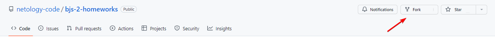

# Домашнее задание к лекции 2 «Функции»

## Задача 1

Написать функцию `getArrayParams(...arr)`, которая получает на вход числа, а возвращает минимальное, максимальное и среднее арифметическое значений массива. Используйте rest-параметр для получения произвольного количества аргументов.

### Что нужно сделать
1. Создайте функцию, которая принимает на ввод массив. 
2. Внутри функции задайте переменные `min, max, sum`, присвоив им некоторые первоначальные значения.
<details>
  <summary>Подсказка. Подумайте, прежде чем открыть.</summary>
Первоначальные значения:
min =  Infinity, 
max = -Infinity.
    Также можно использовать в качестве min и max первый элемент массива.
</details>

3. Пройдите по массиву циклом `for` и для каждого элемента определите:

 * если элемент больше предыдущего максимума, то максимум становится равен элементу;
 * если элемент меньше предыдущего минимума, то минимум становится равен элементу;
 * добавляем элемент к сумме `sum` для последующего вычисления среднего.

4. Для другого подхода можно использовать [Math.max](https://developer.mozilla.org/ru/docs/Web/JavaScript/Reference/Global_Objects/Math/max) и [Math.min](https://developer.mozilla.org/ru/docs/Web/JavaScript/Reference/Global_Objects/Math/min). Для передачи всех аргументов используйте [spread-оператор](https://developer.mozilla.org/en-US/docs/Web/JavaScript/Reference/Operators/Spread_syntax), а для суммирования элементов — метод [reduce](https://developer.mozilla.org/ru/docs/Web/JavaScript/Reference/Global_Objects/Array/Reduce).

5. После прохождения цикла (п. 3) или использования другого подхода (п. 4), функция должна возвращать объект вида `{max:..., min: ..., avg:...}`, то есть минимальное, максимальное и средние значения. Чтобы вычислить среднее, надо сумму элементов поделить на их количество. Среднее надо округлить до двух знаков после запятой. Для округления используйте `toFixed`. Заметьте, `toFixed` возвращает `string`. Так как вам нужно вернуть число (`number`), то необходимо дополнительное преобразование значения к числу.

### Пример
```js
getArrayParams(-99, 99, 10) // { min: -99, max: 99, avg: 3.33 }
getArrayParams(1, 2, 3, -100, 10)  // { min: -100, max: 10, avg: -16.80 }
getArrayParams(5)  // { min: 5, max: 5, avg: 5 }
```

## Задача 2
Представьте, что у вас есть мясорубка с разными насадками. Мясорубка запускает действие, а сам процесс зависит от того, какая будет насадка. Затем мясорубка применяет насадку ко всему мясу, которое в неё поступает, и выдаёт на выход только самый лучший кусок. Используйте rest-параметр для получения произвольного количества аргументов в каждой насадке.

У мясорубки есть несколько насадок-преобразователей:

* насадка суммирования элементов;
* насадка вычисления разницы максимального и минимального элементов;
* насадка вычисления разницы сумм чётных и нечётных элементов;
* насадка вычисления среднего значения чётных элементов.

### Что нужно сделать
1. Напишите функцию `summElementsWorker`, которая должна находить сумму элементов массива и возвращать её. Суммирование элементов можно реализовать аналогично первому заданию c помощью цикла или метода `reduce`.
2. Напишите функцию `differenceMaxMinWorker` для вычисления разницы максимального и минимального элементов.
 
 *    C помощью цикла или методов `Math.max` и `Math.min` найдите максимальное и минимальное значения.
 *    Возвращайте разницу этих значений.
  
3. Напишите функцию `differenceEvenOddWorker` вычисления разницы сумм чётных и нечётных элементов.
 * Объявите две переменные, например, `sumEvenElement` и `sumOddElement`, в которых будут накапливаться чётные и нечётные элементы. Инициализируйте эти переменные начальными значениями — нулями.
 * Реализуйте цикл для перебора всех элементов массива.
 * При переборе каждый элемент проверяйте с помощью конструкции `if / else`.
 * Если элемент чётный, то увеличивайте одну переменную (`sumEvenElement`), а если нечётный, то другую (`sumOddElement`).
 * После выполнения цикла выполняйте возвращение разницы двух элементов.
4. Напишите функцию `averageEvenElementsWorker`, которая будет вычислять среднее значение чётных элементов.
  * Объявите две переменные, например, `sumEvenElement` и `countEvenElement`, в которых будут накапливаться сумма чётных элементов и их количество. Инициализируйте эти переменные начальными значениями — нулями.
  * Реализуйте цикл для перебора всех элементов массива.
  * При переборе каждый элемент проверяйте с помощью конструкции `if`.
  * Если элемент чётный, то увеличивайте одну переменную (`sumEvenElement`) на перебираемый элемент, а другую переменную (`countEvenElement`) — на единицу.
  * После выполнения цикла выполняйте возвращение результата деления суммы элементов на их количество.
5. Во всех функциях должна быть проверка наличия элементов. Если элементы не передавались в функцию, то нет смысла что-либо считать и можно сразу возвращать ноль.

### Пример
```js
// summElementsWorker
console.log(summElementsWorker()); // 0
console.log(summElementsWorker(10, 10, 11, 20, 10)); // 61

// differenceMaxMinWorker
console.log(differenceMaxMinWorker()); // 0
console.log(differenceMaxMinWorker(10, 10, 11, 20, 10)); // 20 - 10 => 10

// differenceEvenOddWorker
console.log(differenceEvenOddWorker(94, 51, 57, 41, 47, 66, 58, 10, 38, 17)); // 266 - 213 => 53
console.log(differenceEvenOddWorker(15, 97, 85, 64, 67, 10, 69, 40, 15, 35)); // 114 - 383 => -269

// averageEvenElementsWorker
console.log(averageEvenElementsWorker(1, 2, 3, 4, 5, 6, 7, 8, 9)); // [2, 4, 6, 8] => 5
console.log(averageEvenElementsWorker(15, 97, 85, 64, 67, 10, 69, 40, 15, 35)); // [64, 10, 40] => 38
```

## Задача 3 
В предыдущем задании вам нужно было написать насадки к мясорубке — преобразователи данных. Теперь необходимо написать саму функцию мясорубки — агрегатор преобразований.

Напишите функцию `makeWork`, которая из массива данных и насадки будет возвращать максимальный результат функции насадки.

1. Функция `makeWork` принимает два аргумента: `arrOfArr` и `func`. В первом аргументе передаётся массив, элементы которого — массивы с данными, которые будут передаваться в функцию-насадку. Вторым аргументом передаётся одна из функций насадок.
2. Инициализируйте переменную (`maxWorkerResult`), в которой будет формироваться максимальный результат, и инициализуйте её начальным значением. Можно использовать самое минимальное числовое значение `-Infinity`, либо использовать результат насадки от самого первого элемента из полученных данных (на позиции ноль массива `arrOfArr`). Используйте [spread-оператор](https://developer.mozilla.org/en-US/docs/Web/JavaScript/Reference/Operators/Spread_syntax) для разделения массива элементов на отдельные элементы.
3. Реализуйте цикл для перебора всех элементов массива `arrOfArr`.
4. Внутри цикла каждый перебираемый элемент передавайте в функцию-насадку. Используйте [spread-оператор](https://developer.mozilla.org/en-US/docs/Web/JavaScript/Reference/Operators/Spread_syntax) для разделения массива элементов на отдельные элементы. Результат функции сохраните в отдельную константу.
5. Добавьте проверку: полученное значение больше переменной, в которой формируется максимальное значение?
6. Если полученное значение больше переменной с максимумом, то переприсваивайте переменную максимума на полученное значение.
7. После выполнение цикла в переменной максимума должно быть максимальное значение результатов насадки. Эту переменную следует возвращать из функции.

### Пример
```js
const arr = [[10, 10, 11, 20, 10], [67, 10, 2, 39, 88], [72, 75, 51, 87, 43], [30, 41, 55, 96, 62]];
console.log(makeWork(arr, summElementsWorker)); // максимум из 61, 206, 328, 284 => 328
console.log(makeWork(arr, differenceMaxMinWorker)); // максимум из 10, 86, 44, 66 => 86
console.log(makeWork(arr, differenceEvenOddWorker)); // максимум из 39, -6, -184, 92 => 92
console.log(makeWork(arr, averageEvenElementsWorker)); // максимум из 12.5, 33.333, 72, 62.666 => 72
```

## Результат при правильном решении задания


## Требования к выполнению домашней работы
# Домашнее задание к лекции 1 «Основные понятия»

Перед выполнением заданий ознакомьтесь с блоком [перед началом работы над проектом](../README.md#перед-началом-работы-над-проектом). Выполните форк репозитория, разверните его с помощью Github pages и выполните задание [Работа с отладкой в браузере](../0.debugger/README.md).
## Задача 1

Написать программу для решения квадратных уравнений (ax² + bx + c = 0).

### Процесс реализации
1. Активируйте [строгий режим](https://learn.javascript.ru/strict-mode) c помощью строки `"use strict";`.
2. Реализуйте функцию `solveEquation`, которая принимает три аргумента: `a`, `b`, `c` — коэффициенты квадратного уравнения.
3. Вычислите дискриминант по формуле `b²-4*a*c`. Для возведения в степень используйте оператор — `**` или функцию [Math.pow](https://developer.mozilla.org/ru/docs/Web/JavaScript/Reference/Global_Objects/Math/pow).
4. Результатом функции должен быть **массив**.
5. Если дискриминант меньше нуля, то корней нет (пустой массив).
6. Если дискриминант равен нулю, то корень один. Его нужно вычислить и вернуть из функции (массив с одним корнем). Формула для вычисления корня: `-b/(2*a)`.
7. Если дискриминант больше нуля, то существует два решения уравнения. Их нужно вычислить и вернуть из функции — массив с двумя корнями: `(-b + Math.sqrt(d) )/(2*a)` и `(-b - Math.sqrt(d) )/(2*a)`.

## Задача 2

Банку «Капитал Кэпиталс» нужно написать калькулятор для расчёта выплат по ипотеке, и они решили поручить эту задачу вам. 

Напишите функцию, которая будет принимать процентную ставку, сумму первоначального взноса, сумму кредита и срок (длительность кредита в месяцах) в качестве аргументов и выдавать сумму, которую в итоге заплатит клиент (первоначальный взнос, погашение основного долга, проценты за пользование кредитом). 

### Что нужно сделать
1. Реализуйте функцию `calculateTotalMortgage`, которая принимает четыре аргумента: `percent`, `contribution`, `amount` и `countMonths`.
2. Преобразуйте процентную ставку из диапазона от 0 до 100 в диапазон от 0 до 1 и из годовой ставки — в месячную.
3. Посчитайте тело кредита — сумму, которую нужно вернуть банку (сумма кредита минус первоначальный взнос).
4. Ежемесячная оплата рассчитывается по формуле: `Платёж = S * (P + (P / (((1 + P)^n) - 1)))`, где:
`S` — тело кредита, `P` — 1/12 процентной ставки (от 0 до 1), `n` — количество месяцев, `^` — возведение в степень. Для возведения в степень используйте оператор — `**` или функцию [Math.pow](https://developer.mozilla.org/ru/docs/Web/JavaScript/Reference/Global_Objects/Math/pow).
5. Посчитайте общую сумму, которую придётся заплатить клиенту.
6. Округлите результат до двух значений после запятой. Результат округления должен быть **числом**.
7. Верните результат из функции. Результатом функции должно быть значение числового типа.

##### Примеры результатов

Ввод: процент (в диапазоне от 0 до 100), начальный взнос, сумма кредита, срок в месяцах

* Ввод: 10, 0, 50000, 12. Вывод: 52749.53
* Ввод: 10, 1000, 50000, 12. Вывод: 51694.54
* Ввод: 10, 0, 20000, 24. Вывод: 22149.56
* Ввод: 10, 1000, 20000, 24. Вывод: 21042.09
* Ввод: 10, 20000, 20000, 24. Вывод: 0
* Ввод: 10, 0, 10000, 36. Вывод: 11616.19
* Ввод: 15, 0, 10000, 36. Вывод: 12479.52

## Результат при правильном решении задания


## Требования по выполнению домашней работы
# Домашнее задание к лекции 4 «Объекты»

### Задача 1. Инкапсуляция студента
Мы хотим инкапсулировать логику работы со студентами в объекты так, чтобы могли создавать студентов, устанавливать им предмет, добавлять оценки, считать средний балл и отчислять.

##### Что нужно сделать

1. Создайте функцию-конструктор `Student(name, gender, age)` и с помощью оператора `new` несколько экземпляров объектов (студентов). Все аргументы функции-конструктора сохраните в соответствующие свойства и добавьте свойство `marks` со значением пустого массива. Позже в этот массив будут добавляться оценки.

2. Создайте доступный для всех экземпляров `student` метод `setSubject(subjectName)`, который при вызове будет устанавливать поле предмет `subject` экземпляра в `subjectName`. Для этого добавьте в свойство `Student.prototype` функции-конструктора функцию `setSubject`.
```js
Student.prototype.setSubject = function (subjectName) {
  //ваш код
}
```

3. Создайте метод `addMarks(...marksToAdd)` по аналогии с п. 2, который при вызове будет добавлять студенту сразу несколько оценок. Перед добавлением оценок добавьте проверку существования свойства `marks`, в котором хранятся оценки. Если пользователь отчислен, то у него не будет массива оценок, а, значит, и добавление будет невозможным.

 **Подсказка**: так как количество добавляемых оценок неизвестно, используйте rest-параметр.

4. Создайте метод `getAverage()` по аналогии с п. 2, который при вызове будет возвращать среднее арифметическое оценок студента. Добавьте проверку наличия оценок у студента. Если свойства `marks` не существует или оно пустое, сразу возвращайте ноль.

5. Создайте метод `exclude(reason)` по аналогии с п. 2, который при вызове будет исключать студента из учебного процесса и устанавливать причину исключения. Для этого надо удалить свойства `subject` и `marks` и добавить свойство `excluded` со значением `reason`.

### Пример:
```js
let student1 = new Student("Василиса", "женский", 19);
student1.setSubject("Algebra");
console.log(student1.getAverage()); // 0
student1.addMarks(4, 5, 4, 5);
console.log(student1.getAverage()); // 4.5
console.log(student1);
// {age: 19, gender: "женский", marks: [4, 5, 4, 5], name: "Василиса", subject: "Algebra"}
let student2 = new Student("Артём", "мужской", 25);
student2.setSubject("Geometry");
student2.exclude('плохая учёба')
console.log(student2)
// {name: "Артём", gender: "мужской", age: 25, excluded: "плохая учёба"}
```

## Результат при правильном решении задания

=======
# Домашнее задание к лекции 6 «Обработка исключений и замыкания»

## Задача 1. Форматтер чисел
Ошибки случаются, и нужно уметь с ними работать. Ваши коллеги разработали форму, которая принимает от пользователя количество покупаемых единиц товара. Вас попросили написать функцию-преобразователь, которая:

* возвращает число, если всё корректно;
* генерирует ошибку, если ввод не является числом в десятичной системе счисления.

Используйте возможности стандартной библиотеки JS для преобразования строки в число.

### Что нужно сделать
1. Напишите функцию `parseCount` .
    * Аргументом функции является значение, которое необходимо распарсить.
    * Для парсинга используйте функцию `Number.parseFloat`.
    * Если результат парсинга — значение `NaN`, то выбрасывайте исключение с ошибкой *«Невалидное значение»*.
    * Верните результат парсинга из функции.

2. Напишите функцию `validateCount`.
    * Аргументом функции является значение, которое необходимо распарсить.
    * Попробуйте распарсить значение с помощью функции `parseCount`.
    * Если распарсить удаётся успешно, то возвращайте результат.
    * Перехватывайте исключение, которое может выбрасывать функция `parseCount`.
    * Возвращайте ошибку из функции в случае перехвата исключения.

## Задача 2. Треугольник 
На этот раз Вася решил создать онлайн-калькулятор геометрических фигур. Помогите ему создать калькулятор треугольников, который сможет проверять существование треугольника, считать площадь и периметр.

### Что нужно сделать
1. Напишите класс `Triangle`.
    * Конструктор класса должен принимать три стороны треугольника.
    * В случае нарушения правила существования треугольника (сумма двух сторон меньше третьей) выбрасывайте исключение с ошибкой *«Треугольник с такими сторонами не существует»*.
    * Геттер `perimeter` должен возвращать периметр треугольника.
    * Геттер `area` должен возвращать площадь треугольника. Для подсчёта площади используйте [формулу Герона](https://ru.wikipedia.org/wiki/%D0%A4%D0%BE%D1%80%D0%BC%D1%83%D0%BB%D0%B0_%D0%93%D0%B5%D1%80%D0%BE%D0%BD%D0%B0). Точность должна вычисляться с обозначением до трёх знаков после запятой.
2. Напишите функцию `getTriangle`.
    * Аргументами функции являются три значения длин сторон.
    * Попытайтесь вернуть новый объект треугольника.
    * В случае перехвата исключения возвращайте объект с двумя геттерами `area` и `perimeter`, которые возвращают строку: *«Ошибка! Треугольник не существует»*.

## Результат при правильном решении задания


## Требования к выполнению домашней работы

1. Все тесты успешно выполняются.
2. Соблюдается [кодстайл](https://github.com/netology-code/codestyle/tree/master/js#%D0%BF%D1%80%D0%B0%D0%B2%D0%B8%D0%BB%D0%B0-%D0%BE%D1%84%D0%BE%D1%80%D0%BC%D0%BB%D0%B5%D0%BD%D0%B8%D1%8F-javascript-%D0%BA%D0%BE%D0%B4%D0%B0).
3. Решение загружено в форкнутый репозиторий GitHub.
4. Решение опубликовано в GitHub Pages.

## Решение задач
1.  Откройте файл `task.js` в вашем редакторе кода и выполните задание. <br>
2.  Проверьте соблюдение [кодстайла](https://github.com/netology-code/codestyle/tree/master/js#%D0%BF%D1%80%D0%B0%D0%B2%D0%B8%D0%BB%D0%B0-%D0%BE%D1%84%D0%BE%D1%80%D0%BC%D0%BB%D0%B5%D0%BD%D0%B8%D1%8F-javascript-%D0%BA%D0%BE%D0%B4%D0%B0). Форматируйте ваш код через форматтер https://codebeautify.org/jsviewer.
3.  Добавьте файл `task.js` в индекс `git` с помощью команды `git add %file-path%`, где `%file-path%` — путь до целевого файла `git add ./2.functions/task.js`. <br>
4.  Сделайте коммит, используя команду `git commit -m '%comment%'`, где `%comment%` — это произвольный комментарий к вашему коммиту `git commit -m 'Второе задание полностью готово'`. <br>
5.  Опубликуйте код в репозиторий `homeworks` с помощью команды `git push -u origin main`.<br>
6. На проверку пришлите 2 ссылки. На файл с решением (`task.js`) и на страницу GitHub Pages — страницу с автотестами: `https://%USERNAME%.github.io/bjs-2-homeworks/2.functions`.
7. Откройте файл `task.js` в вашем редакторе кода и выполните задание. <br>
8. Проверьте соблюдение [кодстайла](https://github.com/netology-code/codestyle/tree/master/js#%D0%BF%D1%80%D0%B0%D0%B2%D0%B8%D0%BB%D0%B0-%D0%BE%D1%84%D0%BE%D1%80%D0%BC%D0%BB%D0%B5%D0%BD%D0%B8%D1%8F-javascript-%D0%BA%D0%BE%D0%B4%D0%B0). Форматируйте ваш код через форматтер https://codebeautify.org/jsviewer.
9. Добавьте файл `task.js` в индекс `git` с помощью команды `git add %file-path%`, где `%file-path%` — путь до целевого файла `git add ./1.base-concepts/task.js`. <br>
10. Сделайте коммит, используя команду `git commit -m '%comment%'`, где `%comment%`, — это произвольный комментарий к вашему коммиту `git commit -m 'Первое задание полностью готово'`. <br>
11. Опубликуйте код в репозиторий `homeworks` с помощью команды `git push -u origin main`.<br>
12. На проверку пришлите 2 ссылки. На файл с решением (`task.js`) и на страницу GitHub Pages — страницу с автотестами: `https://%USERNAME%.github.io/bjs-2-homeworks/1.base-concepts`.
# Домашнее задание к лекции 3 «Массивы»

### Задача 1. Сравнить массивы

Создайте функцию `compareArrays(arr1, arr2)`, которая с помощью функции высшего порядка будет сравнивать значения двух массивов. Если массивы имеют одинаковые значения на одинаковых индексах, `compareArrays` должна выдавать `true` (иначе `false`). Используйте метод `every` для сравнения элементов одного массива с соответствующими элементами другого массива.

Пример вызова:

```javascript
compareArrays([8, 9], [6]) // false, разные значения
compareArrays([8, 9, 5, 4], [8, 9, 5, 4, 8, 3, 5]) // false, разные значения
compareArrays([9, 2, 4, 8, 2], [9, 2, 4]) // false, разные значения
compareArrays([1, 2, 3], [2, 3, 1]) // false, разные индексы, хотя и одинаковые значения
compareArrays([8, 1, 2], [8, 1, 2]) // true
```

### Задача 2. Фильтрация и преобразование массива

Создайте функцию `getUsersNamesInAgeRange(users, gender)`, которая возвращает среднее значение возраста пользователей одного пола.

1. Используйте метод `filter` для получения нужных пользователей.
2. Используйте метод `map` для получения их возрастов, или сразу формируйте среднее значение в `reduce`.
3. Используйте метод `reduce` для формирования среднего значения возраста.

```js
let result = arr.filter(...).map(...).reduce(...)
```

Пример вызова:

```javascript
const people = [
  {firstName: "Александр", secondName: "Карпов", age: 17, gender: "мужской"},
  {firstName: "Егор", secondName: "Морозов", age: 21, gender: "мужской"},
  {firstName: "Мелисса", secondName: "Леонова", age: 40, gender: "женский"},
  {firstName: "Мелания", secondName: "Савельева", age: 37, gender: "женский"},
  {firstName: "Мария", secondName: "Овчинникова", age: 18, gender: "женский"},
  {firstName: "Марьяна", secondName: "Котова", age: 17, gender: "женский"},
  {firstName: "Фёдор", secondName: "Селезнев", age: 50, gender: "мужской"},
  {firstName: "Георгий", secondName: "Петров", age: 35, gender: "мужской"},
  {firstName: "Даниил", secondName: "Андреев", age: 49, gender: "мужской"},
  {firstName: "Дарья", secondName: "Савельева", age: 25, gender: "женский"},
  {firstName: "Михаил", secondName: "Шаров", age: 22, gender: "мужской"},
  {firstName: "Владислав", secondName: "Давыдов", age: 40, gender: "мужской"},
  {firstName: "Илья", secondName: "Казаков", age: 35, gender: "мужской"},
  {firstName: "Евгений", secondName: "Кузьмин", age: 19, gender: "мужской"},
]
console.log(getUsersNamesInAgeRange(people, "мужской")); // 32
console.log(getUsersNamesInAgeRange(people, "женский")); // 27.4
console.log(getUsersNamesInAgeRange([], "женский")); // 0
console.log(getUsersNamesInAgeRange(people, "инопланетянин")); // 0
```

## Результат при правильном решении задания


## Требования к выполнению домашней работы

1.  Все тесты успешно выполняются.
2.  Соблюдается [кодстайл](https://github.com/netology-code/codestyle/tree/master/js#%D0%BF%D1%80%D0%B0%D0%B2%D0%B8%D0%BB%D0%B0-%D0%BE%D1%84%D0%BE%D1%80%D0%BC%D0%BB%D0%B5%D0%BD%D0%B8%D1%8F-javascript-%D0%BA%D0%BE%D0%B4%D0%B0).
3.  Решение загружено в форкнутый репозиторий GitHub.
4.  Решение опубликовано в GitHub Pages.

## Решение задач
1. Откройте файл `task.js` в вашем редакторе кода и выполните задание. <br>
2. Проверьте соблюдение [кодстайла](https://github.com/netology-code/codestyle/tree/master/js#%D0%BF%D1%80%D0%B0%D0%B2%D0%B8%D0%BB%D0%B0-%D0%BE%D1%84%D0%BE%D1%80%D0%BC%D0%BB%D0%B5%D0%BD%D0%B8%D1%8F-javascript-%D0%BA%D0%BE%D0%B4%D0%B0). Форматируйте ваш код через форматтер https://codebeautify.org/jsviewer.
3. Добавьте файл `task.js` в индекс `git` с помощью команды `git add %file-path%`, где `%file-path%` — путь до целевого файла `git add ./3.arrays/task.js`. <br>
4. Сделайте коммит, используя команду `git commit -m '%comment%'`, где `%comment%` — это произвольный комментарий к вашему коммиту `git commit -m 'Третье задание полностью готово'`. <br>
5. Опубликуйте код в репозиторий `homeworks` с помощью команды `git push -u origin main`.<br>
6. На проверку пришлите 2 ссылки. На файл с решением (`task.js`) и на страницу GitHub Pages — страницу с автотестами: `https://%USERNAME%.github.io/bjs-2-homeworks/3.arrays`.

**_Никакие файлы прикреплять не нужно._**

Все задачи обязательны к выполнению для получения зачёта. Можете прислать на проверку как каждую задачу по отдельности, так и все задачи вместе. Во время проверки по частям у вашей домашней работы будет статус «На доработке».


Любые вопросы по решению задач задавайте в чате учебной группы.
# Домашние задания по курсу «Основы Javascript»

0. [Основы отладки](./0.debugger/)

1. [Основные понятия](./1.base-concepts/)

2. [Функции](./2.functions/)

3. [Массивы](./3.arrays/)

4. [Объекты](./4.objects/)

5. [Классы](./5.classes/)

6. [Обработка исключений и замыкания](./6.exception-closure/)

7. [Асинхронность](./7.async/)

8. [Функции декораторы, оператор “...“, call, apply](./8.decorators/)

## Необходимый набор ПО

- браузер (лучше всего подойдет Google Chrome или Яндекс.Браузер);
- редактор кода, например [Sublime][1] или [Visual Studio Code][2];
- аккаунт на [GitHub][7] ([инструкция по регистрации на GitHub][3]);
- система контроля версий [Git][4], установленная локально ([инструкция по установке Git][5]);

## Перед началом работы над проектом

1. Произведите [Fork][0] репозитория с задачами:
После перехода на страницу с домашним заданием из личного кабинета в правом верхнем углу экрана нажмите на кнопку `Fork`:

На экране появится окно с выбором предпочтительного репозитория для клонирования проекта. Выбираете ваш аккаунт и после непродолжительного ожидания вы будете перенаправлены на страницу репозитория на вашем аккаунте.

URL адрес этой страницы будет являться URL адресом вашего репозитория. Пример URL адреса репозитория:
`https://github.com/%username%/bjs-2-homeworks`, где `%username%` - имя вашего профиля GitHub, `%bjs-2-homeworks%` - название репозитория.

2. Разверните репозиторий с помощью github-pages по [инструкции](./assets/gh-pages.md)
3. Перейдите в папку (директорию) на вашем компьютере, где будет храниться проект.
4. С помощью терминала, командной строки вашей операционной системы или консоли Git (ПКМ -> `GitBash Here`) откройте выбранную вами директорию.
5. Склонируйте репозиторий с домашними заданиями с помощью команды `git clone https://github.com/%username%/bjs-2-homeworks` в открывшемся терминале или командной строке.
6. Перейдите в директорию склонированного репозитория `cd ./bjs-2-homeworks`.

## Работа над каждым домашним заданием состоит из нескольких этапов

1. Ознакомьтесь с правилами отладки. Данная [инструкция](https://github.com/netology-code/bjs-2-homeworks/tree/main/0.debugger) входит в проект.
2. Ознакомьтесь с папкой задания. В каждой папке находится несколько файлов:
   1. `README.md` - файл с описанием домашнего задания.
   2. `task.js` - файл для реализации домашнего задания. **Домашние задания выполняются в этом файле.**
   3. `tests.js` - файл с тестами.
   4. `index.html` - файл, запускающий тесты.
3. Ознакомьтесь и реализуйте задания.
4. Код из домашних заданий можно вызывать как из консоли, так и со страницы.
5. Проверьте работу ваших заданий, запустив тесты jasmine (открыв файл `index.html` в браузере).
6. В случае успеха прохождения тестов можно сдавать задание.

**!ВНИМАНИЕ!** Прохождение тестов не означает полностью правильную реализацию домашнего задания. Тесты проверяют правильность вычисления задания, но не чистоту кода и правильность выполнения домашнего задания.

## Решение задач

1. Перейдите в папку задания, например, для первого задания `1.base-concepts`.
2. Откройте файл `task.js` в вашем редакторе кода и выполните задание.
3. Добавьте файл `task.js` в индекс `git` с помощью команды `git add %file-path%`, где `%file-path%` - путь до целевого файла, например, для первого задания `git add task.js`.
4. Сделайте коммит, используя команду `git commit -m '%comment%'`, где `%comment%` - это произвольный комментарий к вашему коммиту, например, для первого задания `git commit -m 'Реализовано первое задание'`.
5. Опубликуйте код в репозиторий `homeworks` с помощью команды `git push -u origin main`.
6. Пришлите ссылку на репозиторий через личный кабинет на сайте [Нетологии][6].

[0]: https://ru.wikipedia.org/wiki/%D0%A4%D0%BE%D1%80%D0%BA
[1]: https://www.sublimetext.com/
[2]: https://code.visualstudio.com/
[3]: https://github.com/netology-code/guides/tree/master/github
[4]: https://git-scm.com/
[5]: https://github.com/netology-code/guides/blob/master/git/README.md
[6]: https://netology.ru/
[7]: https://github.com/

Любые вопросы по решению задач задавайте в чате учебной группы.
1. Откройте файл `task.js` в вашем редакторе кода и выполните задание. <br>
2. Проверьте соблюдение [кодстайла](https://github.com/netology-code/codestyle/tree/master/js#%D0%BF%D1%80%D0%B0%D0%B2%D0%B8%D0%BB%D0%B0-%D0%BE%D1%84%D0%BE%D1%80%D0%BC%D0%BB%D0%B5%D0%BD%D0%B8%D1%8F-javascript-%D0%BA%D0%BE%D0%B4%D0%B0). Форматируйте ваш код через форматтер https://codebeautify.org/jsviewer.
3. Добавьте файл `task.js` в индекс `git` с помощью команды `git add %file-path%`, где `%file-path%` — путь до целевого файла `git add ./4.objects/task.js`. <br>
4. Сделайте коммит, используя команду `git commit -m '%comment%'`, где `%comment%` — это произвольный комментарий к вашему коммиту `git commit -m 'Четвёртое задание полностью готово'`. <br>
5. Опубликуйте код в репозиторий `homeworks` с помощью команды `git push -u origin main`.<br>
6. На проверку пришлите 2 ссылки. На файл с решением (`task.js`) и на страницу GitHub Pages — страницу с автотестами: `https://%USERNAME%.github.io/bjs-2-homeworks/4.objects`.

**_Никакие файлы прикреплять не нужно._**

Все задачи обязательны к выполнению для получения зачета. Присылать на проверку можно каждую задачу по отдельности или все задачи вместе. Во время проверки по частям ваша домашняя работа будет со статусом "На доработке".

Любые вопросы по решению задач задавайте в чате учебной группы.

# Домашнее задание к лекции 5 «Классы»

## Задача 1. Печатное издание

Задача продолжает идеи, заложенные в предыдущем ДЗ, но уже с использованием всех возможностей классов. 

Нужно помочь перевести небольшую районную библиотеку в современный цифровой формат. Начнём с реализации нескольких классов: 

- классы печатных изданий — книг, журналов;
- класс библиотеки, который позволит работать с печатными изданиями: хранить их, выдавать читателям, принимать обратно.

### Что нужно сделать

Печатные издания бывают разных видов, но между всеми книгами, сборниками и журналами есть много общего: у всех них есть название, год издания, страницы, они могут повреждаться с процессе использования.

1. Создайте базовый класс `PrintEditionItem` со свойствами:

   - `name`;
   - `releaseDate`;
   - `pagesCount`;
   - `state`;
   - `type`.

 Конструктор класса должен принимать название (`name`), дату выпуска (`releaseDate`) и количество страниц (`pagesCount`) в качестве аргумента. Состояние (`state`) по умолчанию должно быть `100`, тип `type` пока должен быть равен `null`.

2. Испорченное издание можно подклеить и улучшить его состояние. Создайте метод `fix()`, увеличивающий `state` в полтора раза. Метод не должен принимать аргументы.

3. Нельзя улучшить новое издание, также бесполезно подклеивать полностью уничтоженное. Чтобы лучше контролировать состояние книг, создайте «сеттер» для свойства `state`, принимающий в качестве аргумента новое состояние печатного издания (число).

   Если новое состояние меньше `0`, «сеттер» должен записать в свойство `state` значение `0`. Если новое состояние больше `100`, должно быть записано значение `100`. В остальных случаях в свойство `state` должно быть записано переданное в «сеттер» значение.

4. Создайте «геттер», который позволит читать значение свойства `state`.

 **Пример использования**

 ```js
const sherlock = new PrintEditionItem(
  "Полное собрание повестей и рассказов о Шерлоке Холмсе в одном томе",
  2019,
  1008
);

 console.log(sherlock.releaseDate); //2019
console.log(sherlock.state); //100
sherlock.fix();
console.log(sherlock.state); //100
```

5. Создайте класс `Magazine`, который будет наследоваться от класса `PrintEditionItem`. Конструктор класса должен принимать такие же параметры, как и класс-родитель. От базового печатного издания журнал отличается только указанным типом. Значение свойства `type` должно быть равно `"magazine"`.

6. Создайте класс `Book`, который наследуется от класса `PrintEditionItem`. Конструктор класса должен принимать такие же параметры, как и класс-родитель, и имя автора книги `author`. Значение свойства `type` должно быть равно `"book"`.

7. Создайте классы, которые наследуются от класса `Book`: `NovelBook` — для романов, `FantasticBook` — для фантастических произведений и `DetectiveBook` — для детективов. Значения свойства `type` должны быть равны `"novel"`, `"fantastic"` и `"detective"` соответственно.

**Пример использования**

```js
const picknick = new FantasticBook(
  "Аркадий и Борис Стругацкие",
  "Пикник на обочине",
  1972,
  168
);

console.log(picknick.author); //"Аркадий и Борис Стругацкие"
picknick.state = 10;
console.log(picknick.state); //10
picknick.fix();
console.log(picknick.state); //15
```

## Задача 2. Библиотека

Теперь с помощью классов можно описать все возможные печатные издания, которые бывают в библиотеке. Пришло время подготовить саму библиотеку к работе в цифровом режиме — реализовать возможность хранить книги, выдавать их читателям и принимать обратно.

### Что нужно сделать

1. Создайте класс `Library` со свойствами:

   - `name`;
   - `books`.

   Конструктор класса должен принимать название библиотеки `name` (строка). Значением свойства `books` должен быть пустой массив.

2. Реализуйте метод `addBook(book)`, который в качестве аргумента будет принимать объект — книгу или журнал. Метод должен добавлять книгу в хранилище `books`, только если состояние `state` книги больше `30`.

3. Создайте метод `findBookBy(type, value)`, который в качестве аргументов будет принимать ключ для проведения поиска (тип, автор, название, год выпуска и пр.) и искомое значение. Метод должен возвращать книгу в случае успеха и `null`, если запрошенная книга не была найдена.

4. Создайте метод `giveBookByName(bookName)`, который в качестве аргумента будет принимать название книги, запрошенной читателем. Если запрошенная книга найдена, метод должен удалять книгу из хранилища `books` и возвращать её. Если книга не была найдена, метод должен возвращать `null`.

 **Пример использования**

 ```js
const library = new Library("Библиотека имени Ленина");

 library.addBook(
  new DetectiveBook(
    "Артур Конан Дойл",
    "Полное собрание повестей и рассказов о Шерлоке Холмсе в одном томе",
    2019,
    1008
  )
);
library.addBook(
  new FantasticBook(
    "Аркадий и Борис Стругацкие",
    "Пикник на обочине",
    1972,
    168
  )
);
library.addBook(new NovelBook("Герберт Уэллс", "Машина времени", 1895, 138));
library.addBook(new Magazine("Мурзилка", 1924, 60));

 console.log(library.findBookBy("name", "Властелин колец")); //null
console.log(library.findBookBy("releaseDate", 1924).name); //"Мурзилка"

 console.log("Количество книг до выдачи: " + library.books.length); //Количество книг до выдачи: 4
library.giveBookByName("Машина времени");
console.log("Количество книг после выдачи: " + library.books.length); //Количество книг после выдачи: 3
```

5. Протестируйте корректность работы классов и методов, реализовав тестовый сценарий:
   - создайте библиотеку;
   - добавьте в библиотеку несколько печатных изданий разных типов;
   - найдите книгу, изданную в 1919 году, или создайте её при необходимости;
   - выдайте любую книгу;
   - повредите выданную книгу;
   - восстановите выданную книгу;
   - попытайтесь добавить восстановленную книгу обратно в библиотеку.

## Задача 3. Журнал успеваемости *

> Это задача со звёздочкой. Её выполнение не влияет на получение допуска к дипломной работе, но поможет усвоить пройденный материал. 

Мы продолжаем совершенствовать журнал успеваемости студентов. Нужно преобразовать код прошлого ДЗ к классам. Реализуйте возможности:

1. В конструкторе класса сохраняйте имя пользователя и создавайте свойство для хранения оценок.
<details>
  <summary>В какой структуре хранить оценки по разным предметам?</summary>
    Удобней всего хранить оценки в виде объекта, где свойством будет название предмета, а значением свойства — массив оценок по этому предмету. Начальным значением будет пустой объект.

    {
      "физика": [4, 5, 5, 4],
      "химия": [3, 4],
      "литература": [4],
      "информатика": [5, 5, 5]
    }
</details>

2. Метод `addMark`, который будет добавлять оценку по предмету.

 * Валидируйте оценку. Она должна быть не меньше 2 и не больше 5. Если значение выходит за пределы этого диапазона, оценка не должна добавиться, и метод следует завершать.
 * Проверьте наличие предмета. Если предмет отсутствует в свойстве `marks`, то добавляйте новое свойство, названием которого будет название предмета, а значением — пустой массив.
  * Добавляйте в массив оценок по переданному свойству новый элемент, который был получен аргументом метода.
3. Метод `getAverageBySubject`, который будет возвращать среднюю оценку по одному предмету.
    * Проверьте наличие предмета среди оценок. Если предмет отсутствует, сразу возвращайте ноль.
    * С помощью `reduce` посчитайте сумму оценок по одному предмету.
    * Возвращайте результат деления суммы оценок на их количество.
4. Метод `getAverage`, который будет возвращать общую среднюю оценку по всем предметам.
    * Используйте метод `Object.keys` для получения всех названий предметов.
    * С помощью метода `reduce` или использования цикла перебирайте все предметы. Для каждого считайте среднюю оценку с помощью метода `getAverageBySubject` и суммируйте полученные значения.
    * Возвращайте результат деления суммы средних оценок на количество предметов.

Для решения задания нужно придумать структуру данных для хранения оценок по предметам. Это представляет наибольшую сложность. Работать должно, как в примере:

```js
class Student {
  // ваш код
}

const student = new Student("Олег Никифоров");
student.addMark(5, "химия");
student.addMark(5, "химия");
student.addMark(5, "физика");
student.addMark(4, "физика");
student.addMark(6, "физика"); // Оценка не добавится, так как больше 5
student.getAverageBySubject("физика"); // Средний балл по предмету физика 4.5
student.getAverageBySubject("биология"); // Вернёт 0, так как по такому предмету нет никаких оценок.
student.getAverage(); // Средний балл по всем предметам 4.75
```

### Критерии выполнения

- Реализованы все методы, в каждом из которых приведены примеры работы исключительных случаев: неверный формат оценки, несуществующий предмет и т. д.
- Возможно добавление оценки по любому предмету.

## Результат при правильном решении основного задания


## Результат при правильном выполнении дополнительного задания


## Требования к выполнению домашней работы

1. Все тесты успешно выполняются.
1. Соблюдается [кодстайл](https://github.com/netology-code/codestyle/tree/master/js#%D0%BF%D1%80%D0%B0%D0%B2%D0%B8%D0%BB%D0%B0-%D0%BE%D1%84%D0%BE%D1%80%D0%BC%D0%BB%D0%B5%D0%BD%D0%B8%D1%8F-javascript-%D0%BA%D0%BE%D0%B4%D0%B0).
1. Решение загружено в форкнутый репозиторий GitHub.
1. Решение опубликовано в GitHub Pages.

## Решение задач
1. Откройте файл `task.js` в вашем редакторе кода и выполните задание. <br>
2. Проверьте соблюдение [кодстайла](https://github.com/netology-code/codestyle/tree/master/js#%D0%BF%D1%80%D0%B0%D0%B2%D0%B8%D0%BB%D0%B0-%D0%BE%D1%84%D0%BE%D1%80%D0%BC%D0%BB%D0%B5%D0%BD%D0%B8%D1%8F-javascript-%D0%BA%D0%BE%D0%B4%D0%B0). Форматируйте ваш код через форматтер https://codebeautify.org/jsviewer.
3. Добавьте файл `task.js` в индекс `git` с помощью команды `git add %file-path%`, где `%file-path%` — путь до целевого файла `git add ./5.classes/task.js`. <br>
4. Сделайте коммит, используя команду `git commit -m '%comment%'`, где `%comment%` — это произвольный комментарий к вашему коммиту `git commit -m 'Пятое задание полностью готово'`. <br>
5. Опубликуйте код в репозиторий `homeworks` с помощью команды `git push -u origin main`.<br>
6. На проверку пришлите 2 ссылки. На файл с решением (`task.js`) и на страницу GitHub Pages — страницу с автотестами: `https://%USERNAME%.github.io/bjs-2-homeworks/5.classes`.
1. Откройте файл `task.js` в вашем редакторе кода и выполните задание. <br>
2. Проверьте соблюдение [кодстайла](https://github.com/netology-code/codestyle/tree/master/js#%D0%BF%D1%80%D0%B0%D0%B2%D0%B8%D0%BB%D0%B0-%D0%BE%D1%84%D0%BE%D1%80%D0%BC%D0%BB%D0%B5%D0%BD%D0%B8%D1%8F-javascript-%D0%BA%D0%BE%D0%B4%D0%B0). Форматируйте ваш код через форматтер https://codebeautify.org/jsviewer.
3. Добавьте файл `task.js` в индекс `git` с помощью команды `git add %file-path%`, где `%file-path%` — путь до целевого файла `git add ./6.exception-closure/task.js`. <br>
4. Сделайте коммит, используя команду `git commit -m '%comment%'`, где `%comment%` — это произвольный комментарий к вашему коммиту `git commit -m 'Шестое задание полностью готово'`. <br>
5. Опубликуйте код в репозиторий `homeworks` с помощью команды `git push -u origin main`.<br>
6. На проверку пришлите 2 ссылки. На файл с решением (`task.js`) и на страницу GitHub Pages — страницу с автотестами: `https://%USERNAME%.github.io/bjs-2-homeworks/6.exception-closure`.


**_Никакие файлы прикреплять не нужно._**

Все задачи обязательны к выполнению для получения зачёта. Можете прислать на проверку как каждую задачу по отдельности, так и все задачи вместе. Во время проверки по частям у вашей домашней работы будет статус «На доработке».


Любые вопросы по решению задач задавайте в чате учебной группы.


